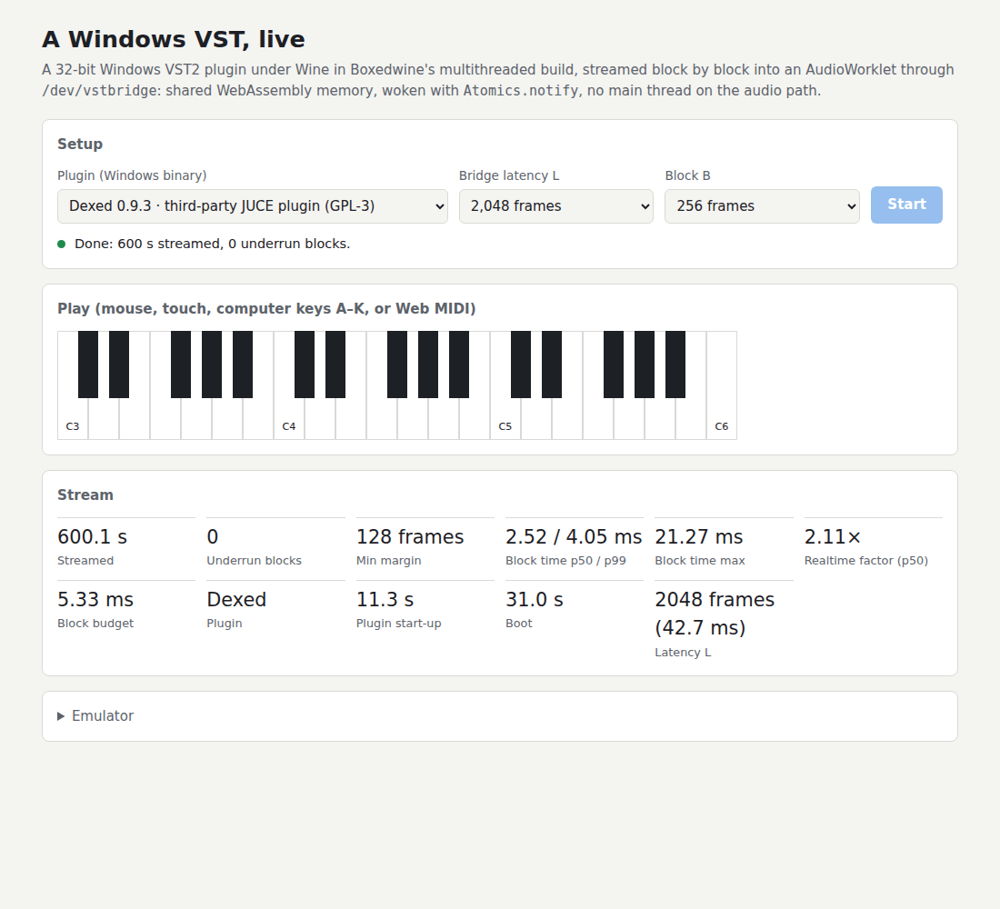

# prometheos-webclap-vstloader

Runs **unmodified 32-bit Windows VST2 and VST3 plugin binaries inside a browser
tab**, in real time.

This repository was split out of
[prometheos-apps](https://github.com/dahlgrenmartin/prometheos-apps)
(`experiments/boxedwine-vst`, with its history) because Boxedwine is GPL: the
emulator, its patches and everything built around them live here, and
buzz-remote only loads the result as a WebCLAP plugin. The next step is that
WebCLAP: a thin real-time shim that runs in the host's AudioWorklet and talks to
the emulator through shared memory (see the
[design spec](docs/design/2026-10-04-realtime-windows-plugins-design.md) and
the plan in "Next" below).

The rest of this README describes the proof of concept and the real-time bridge.
A Windows host program loads the plugin under Wine,
inside [Boxedwine](https://github.com/danoon2/Boxedwine), an x86 emulator that
compiles to WebAssembly with Emscripten. The audio the plugin renders comes back
to the web page, which decodes, draws and plays it.

The design borrows from [yabridge](https://github.com/robbert-vdh/yabridge):
there, a native Linux plugin talks to a long-lived Wine-side host process that
loads the Windows plugin. Here the "native" side is the web page, the Wine side
is `vsthost.exe` inside Boxedwine, and the transport is the emulator's
filesystem instead of sockets and shared memory.

```text
browser page (web/)                        Boxedwine (WebAssembly)
  ├─ boots the emulator once (~20 s) ───▶   Wine 11 (TinyCore filesystem zip)
  │                                           └─ vsthost.exe --serve C:\vstpoc-jobs
  ├─ writes a job into C:\vstpoc-jobs\inbox.txt ──▶ ├─ LoadLibrary(plugin.dll | plugin.vst3)
  │    (through Emscripten's FS)                    ├─ VST2: VSTPluginMain → AEffect
  │                                                 ├─ VST3: GetPluginFactory → IComponent/IAudioProcessor
  │                                                 └─ renders a MIDI chord → WAV + JSON report
  └─ reads C:\vstpoc-out\<n>.json/.wav  ◀──────── C:\vstpoc-out
       → WebAudio decode, waveform, playback
```


## What is in here

| Path | What |
|---|---|
| `host/bridge.cpp`, `host/vst2_instance.cpp` | `vsthost --bridge`: real-time hosting through `/dev/vstbridge` (one thread per plugin instance), and `vsthost --replay`, the offline reference that renders a captured request stream through the same code. |
| `include/vstbridge_abi.h` | The shared-memory layout of `/dev/vstbridge` (the single source of truth; `vstbridge_abi.json` is its golden layout, checked against the JS and TypeScript twins and the patch's copy). |
| `web/realtime.html` | Streams a plugin live into an AudioWorklet (on-screen keyboard, computer keys, Web MIDI), with underrun and block-time readouts; `tests/realtime.mjs` and `tests/identity.mjs` drive it headlessly. |
| `host/vsthost.cpp` | The Windows-side host (MinGW, i686). VST2 through a clean-room ABI header, VST3 through Steinberg's MIT-licensed `pluginterfaces` only. One-shot mode, or persistent `--serve <dir>` mode that takes jobs from a mailbox file. Writes a WAV, a JSON report (plugin info, parameters with display text, peak/RMS, non-finite sample count, load/render time) and a stage trace. `--play` also sends the render to the Windows audio device (`waveOut`), which Boxedwine plays through browser audio. |
| `include/vst2_abi.h` | The VST 2.4 binary interface written from the published ABI (as LMMS's VeSTige does); no Steinberg VST2 SDK code. |
| `plugins/vst2`, `plugins/vst3` | "PoC Synth": the same 8-voice saw synth as a VST2 `.dll` and a VST3 `.vst3`, built here so the pipeline can be tested without third-party binaries. |
| `vendor/pluginterfaces` | Steinberg VST3 `pluginterfaces` (MIT), pinned to `4f547e8` (VST3 SDK 3.8.1). |
| `patches/boxedwine/` | Fixes to Boxedwine needed for this (see below). |
| `web/` | The demo page. |
| `build.sh` | Builds the Windows binaries, `vstpoc.zip` and the static site in `dist/`. |
| `serve.py` | Serves `dist/` with COOP/COEP headers. |
| `tests/` | `browser_render.mjs` (headless Chromium end-to-end), `fputest.c` and `wintest.c` (emulator diagnostics). |
| `docs/results.md` | Measurements, and the problems found and fixed on the way. |
| `docs/performance.md` | Why emulation is slow next to yabridge, and the options for real-time use. |
| [real-time design spec](docs/design/2026-10-04-realtime-windows-plugins-design.md) | Design spec and [Phase 0 plan](docs/design/2026-10-04-realtime-windows-plugins-phase0.md) for real-time Windows plugins in buzz-remote, browser-only. |

## Results

**Real time:** Dexed streams live into an AudioWorklet from Boxedwine's
multithreaded build through `/dev/vstbridge` (shared WebAssembly memory, Atomics
wake-ups, no main thread on the audio path): 10 minutes of sequenced 8-voice
chords at 48 kHz with **zero underruns at L = 2,048 frames**, and its output,
shifted by L, is bit-identical to the offline render of the same requests. See
[results.md](docs/results.md#real-time-phase-0-dexed-streamed-live-into-an-audioworklet).



**Offline:** measured in headless Chromium (details and screenshots in
[docs/results.md](docs/results.md)):

| Plugin | Format | Origin | In the browser (audio processing) | Natively (x64 JIT) |
|---|---|---|---|---|
| PoC Synth | VST2 | built here | renders, peak 0.42, ~20× realtime | renders, 50× realtime |
| PoC Synth | VST3 | built here | renders, peak 0.42, ~12× realtime | renders, 16× realtime |
| **Dexed 0.9.3** | VST2 | third party (JUCE, MSVC, 2017) | **renders, peak 0.35, 155 parameters, 3.8–4.7× realtime** | blocks in `VSTPluginMain` (headless window creation, see below) |

The emulator boots to a serving `vsthost` in about 20 s. Dexed's first
`VSTPluginMain` in a session takes about 9 s (one-off JUCE/Wine start-up). The
audio processing itself is faster than realtime from the first render. `--play`
was verified to play through Boxedwine's browser audio (`waveOut: played 44100
frames`).

Emulation is still about 100–200× slower than native code: the same synth DSP
takes 0.86 ms natively, 0.79 ms as WebAssembly compiled from source, and about
100–170 ms as an x86 DLL under Boxedwine in the browser.
**[docs/performance.md](docs/performance.md)** explains why, and lays out the
options for real-time use: streaming with the plugin kept loaded and
render-ahead, a faster JIT, static recompilation of plugin DLLs to WebAssembly
("plugin recomp"), source ports to WebCLAP, and a local native companion.

## Boxedwine changes

Boxedwine `509f6a7` (2026-10-02) was used with two local patches:

1. `0001-fpu-frndint-honours-chop.patch`: **an emulation bug found by this
   PoC.** In the interpreter's (and the WebAssembly JIT's) shared FPU code,
   `FRNDINT` ignored the x87 "chop" rounding mode, because `FPU::FROUND`
   leaves chopping to its integer-store callers' casts. The standard x87
   `exp`/`pow` sequence (`fldcw` chop → `frndint` → `f2xm1` → `fscale`, used by
   MinGW's libm and common in compiled DSP code) then returned exactly `1.0`,
   so the test synth rendered digital silence in the browser while working
   under the native x64 JIT (which rounds correctly). `tests/fputest.c`
   reproduces it.
2. `0002-emscripten-link-with-em++.patch`: links with `em++`. Current
   Emscripten (6.x) no longer pulls libc++ into an `emcc` link of C++ objects.

## Build and run

Requirements: `i686-w64-mingw32-gcc/g++`, an Emscripten SDK, Python 3, `zip`.

```bash
git submodule update --init vendor/pluginterfaces

# Boxedwine for the browser
git clone https://github.com/danoon2/Boxedwine && cd Boxedwine
git checkout 509f6a7
git apply /path/to/prometheos-webclap-vstloader/patches/boxedwine/*.patch
cd project/emscripten && make jit        # -> Build/Jit/boxedwine.{html,js,wasm}
make multiThreadedJit                     # -> Build/MultiThreadedJit (the real-time page needs it)

# The PoC (downloads the Wine filesystem zip; WITH_DEXED=1 adds Dexed 0.9.3 win32)
cd prometheos-webclap-vstloader
BOXEDWINE_BUILD=/path/to/Boxedwine/project/emscripten/Build/Jit WITH_DEXED=1 ./build.sh
python3 serve.py 8080 dist      # open http://127.0.0.1:8080/

# Real time (multithreaded build): open /realtime.html
BOXEDWINE_BUILD=/path/to/Boxedwine/project/emscripten/Build/MultiThreadedJit DIST=dist-mt WITH_DEXED=1 ./build.sh
python3 serve.py 8080 dist-mt
node tests/realtime.mjs http://127.0.0.1:8080 --plugin Dexed.dll --latency 2048 --seconds 600
```

The Phase 1 measurements in `docs/results.md` were taken with buzz-remote's
in-tree `winvst` machine and its `tests/winvst-browser` harness (prometheos-apps
branch `feat/buzz-winvst-mvp`), which the WebCLAP replaces.

Emscripten fetches its zlib and SDL2 ports from GitHub archive URLs. Behind a
proxy that refuses those, clone `madler/zlib@v1.3.2` and
`libsdl-org/SDL@release-2.32.10` into Emscripten's `cache/ports/{zlib,sdl2}/`
with a matching `.emscripten_url` marker.

## Limitations and next steps

- **32-bit plugins only.** Boxedwine emulates 32-bit x86, so modern 64-bit-only
  plugins (most current releases) cannot load. Older free plugins often still
  ship 32-bit builds.
- **Real time needs the multithreaded build and L = 2,048 frames** (42.7 ms) for
  Dexed; lighter plugins can run with less. `index.html` still renders offline.
- **Speed.** Emulated plugin code runs about 100–200× slower than native.
  Dexed still processes at about 4× realtime, but heavier plugins will not fit;
  see [docs/performance.md](docs/performance.md).
- **No plugin editors.** Plugin GUIs would need Boxedwine's window output (it
  already draws Wine windows to a canvas) wired to `effEditOpen` / `IPlugView`.
- **JUCE plugins under headless native Boxedwine.** Creating any window (even a
  hidden `STATIC` control, see `tests/wintest.c`) hangs this native Boxedwine
  build under Xvfb, so JUCE plugins like Dexed, which create a message window
  inside `VSTPluginMain`, block there natively. The browser build has a real
  canvas and Dexed works there.
- **Start-up cost.** The Wine filesystem zip is 158 MB, and every page load
  starts from a fresh in-memory prefix. Boxedwine can persist the prefix and its
  JIT cache in IndexedDB, which would make later visits faster.

## Next: the WebCLAP

1. **Shim** (`wclap/`, C, wasi-sdk): a WebCLAP whose `process()` does what
   buzz-remote's `WinVstMachine` did: one request per 256-frame block into
   rings in its own shared memory, output read L frames later, `clap.latency`
   = L + the plugin's delay, parameters and ports from a descriptor frozen at
   wrap time, state through the plugin's chunk.
2. **Runtime**: Boxedwine (multithreaded) with `vsthost --bridge`, in a hidden
   frame the host loads once for all wrapped plugins, plus a relay worker that
   moves each block between the shim's memory and `/dev/vstbridge`. Audio never
   touches the main thread.
3. **Wrapper**: a `.dll` in, a `.wclap` bundle out (shim, the DLL, the frozen
   descriptor and the runtime's URL and integrity hash).
4. **Gate**: the Phase 1 numbers through buzz-remote's WebCLAP path: Dexed
   10 minutes with 0 underruns at L = 2,048, output bit-identical to
   `vsthost --replay`, the invert null and the `.bzw` round trip.

## Licenses

- This repository (`vsthost`, the bridge, the patches, the test plugins and
  pages): GPL-3.0 (`LICENSE`).
- `vendor/pluginterfaces`: MIT (Steinberg Media Technologies).
- Boxedwine: GPL-2.0-or-later. Wine: LGPL-2.1-or-later.
- Dexed (optional download, not committed): GPL-3.0.
