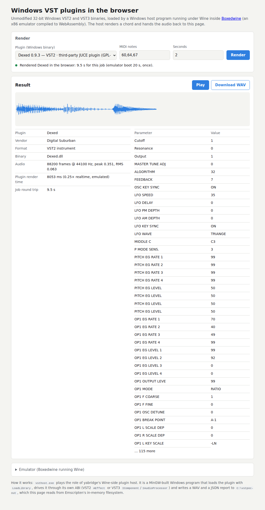

# Results

Measured on 2026-10-04 with Boxedwine `509f6a7` plus the two patches in
`patches/boxedwine/`, the `jit` Emscripten target (Emscripten 6.0.11), the Wine
11 filesystem `TinyCore15Wine11.0.zip` (SHA-256 `e38234f9…6b79`) and headless
Chromium (Playwright). Every render is a 3-note chord (MIDI 60, 64, 67) at
44.1 kHz with a note-off at 60 % of the length.

## In the browser

`tests/browser_render.mjs` against `dist/`, one page session, one emulator boot:

| Plugin | Format | Origin | Peak | RMS | Params | Audio processing (2 s of audio) | Plugin start-up |
|---|---|---|---|---|---|---|---|
| PoC Synth | VST2 | built here (MinGW) | 0.419 | 0.118 | 3 | 97 ms (**~20× realtime**) | 0.2 s |
| PoC Synth | VST3 | built here (MinGW) | 0.419 | 0.118 | 3 | 167 ms (**~12× realtime**) | 0 s |
| Dexed 0.9.3 | VST2 | asb2m10, JUCE, MSVC, 2017 | 0.351 | 0.063 | 155 | 430–530 ms (**3.8–4.7× realtime**) | 9.1 s first time, then 0.55 s |

Start-up is a one-off cost per load: the first `VSTPluginMain` in a session
runs JUCE's and Wine's GUI start-up through a cold JIT. In this
render-per-job harness, each job also pays `LoadLibrary` (0.5 s) and Dexed's
`FreeLibrary` (6–8 s while JUCE stops its threads); a real-time host would load
the plugin once. See [performance.md](performance.md).

- Emulator boot until `vsthost --serve` is ready: **20 s** (from page load, with
  the Wine zip served locally).
- No non-finite samples in any render.
- The VST2 and VST3 builds of the test synth produce identical statistics, so
  both ABIs deliver the same MIDI and audio.
- `--play` (Windows `waveOut`) plays the render through Boxedwine's browser
  audio backend: `waveOut: played 44100 frames`.

## Natively (Linux, Boxedwine x64 JIT)

| Plugin | Format | Result |
|---|---|---|
| PoC Synth | VST2 | peak 0.42, 50× realtime |
| PoC Synth | VST3 | peak 0.42, 16× realtime |
| Dexed 0.9.3 | VST2 | `LoadLibrary` succeeds; blocks in `VSTPluginMain` |

Native Dexed blocks because creating any window hangs this headless native
setup: `tests/wintest.c`, which only creates a hidden `STATIC` window, hangs the
same way under Xvfb, crashes Boxedwine with `-novideo` and exits silently with
SDL's dummy video driver. The browser build has a real canvas and Dexed works
there.

## Problems found and fixed on the way

| Symptom | Cause | Fix |
|---|---|---|
| Test synth renders exact silence in the browser; `exp`/`pow` return `1.0` (`tests/fputest.c`) | Boxedwine's shared FPU code ignored the x87 chop rounding mode in `FRNDINT`, breaking the `fldcw`/`frndint`/`f2xm1`/`fscale` idiom of x87 `exp`/`pow`. The native x64 JIT rounds correctly, which hid the bug natively for hot code. | `patches/boxedwine/0001-fpu-frndint-honours-chop.patch` |
| Every browser start waits ~300 s (`run_wineboot boot event wait timed out`) | The zip's prefix timestamp never matches, so Wine reruns `wineboot -u` on every fresh in-memory prefix, and in the browser that update never signals completion. | `vstpoc-prefix.zip`, layered first (`root=`), holds `.update-timestamp` = `disable` |
| Jobs dropped into the guest's directory never run | Boxedwine caches directory listings; files created by the page through Emscripten's FS are invisible to `FindFirstFile`. | Mailbox protocol: the guest creates `inbox.txt` and the page only rewrites its contents. |
| Nothing written to `D:` | `-mount_drive` did not produce a usable drive in this build (natively either). | Outputs go to `C:\vstpoc-out`, in the Wine prefix. |
| Link fails with undefined `operator new` | Emscripten 6 does not add libc++ to an `emcc` link. | `patches/boxedwine/0002-emscripten-link-with-em++.patch` |
